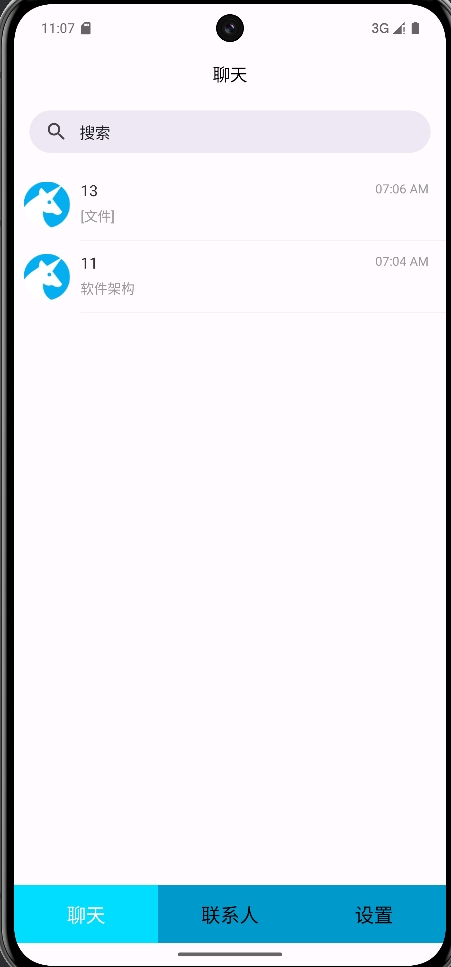
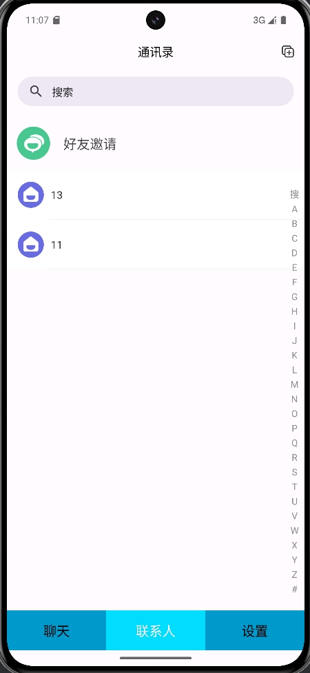
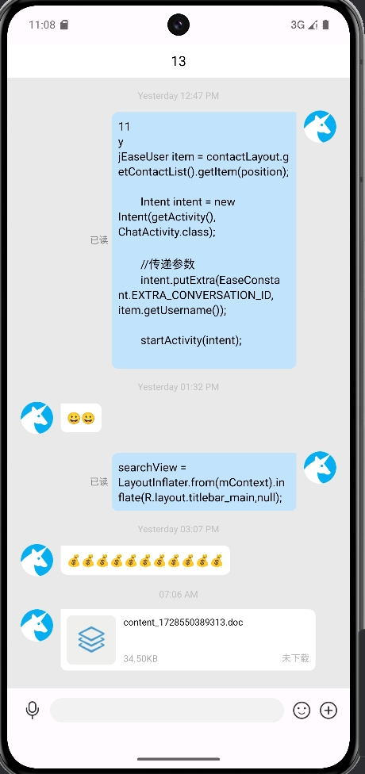

# TinyChatBox 迷你聊天软件

 

**产品名称**：TinyChatBox

**产品定位**：
TinyChatBox是一款基于环信SDK开发的即时聊天通讯软件，旨在满足用户在日常生活中的沟通需求，无论是工作交流还是亲友聊天，都能得到完美的体验。

**主要功能**：

1. **即时消息传输**：支持文字、语音、图片、视频等多种消息类型的即时传输，确保用户能够随时随地与他人保持联系。

2. **好友管理**：提供好友邀请、添加等功能，方便用户管理自己的社交圈。

3. **隐私保护**：提供聊天记录本地存储等隐私保护功能，确保用户的聊天内容不被泄露。

4. **文件传输**：支持文档、图片、视频等文件的传输，方便用户分享资料。

**最终效果截图**:

